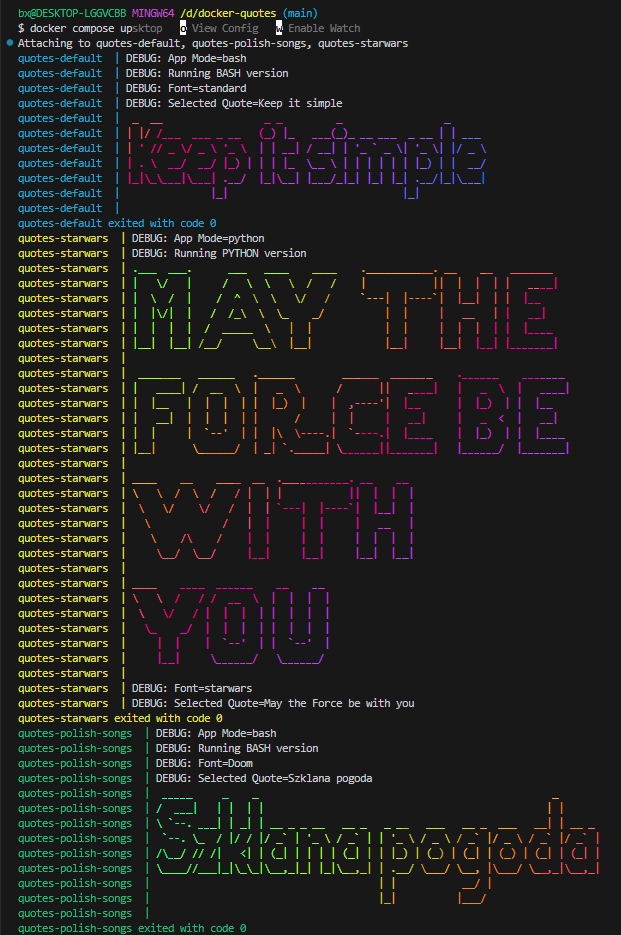

<div align="center">

<h1>Dockerized ASCII Quote Generators: Optimized Multi-Variant Collection</h1>
<p><strong>Star Wars & Polish-Music inspired quotes rendered with FIGlet on Alpine Linux.</strong></p>

<p>
    <a href="https://github.com/ovis22/docker-quotes/actions">
      
    </a>
    <a href="https://github.com/ovis22/docker-quotes/commits/main">
      
    </a>
    <a href="https://www.docker.com/">
      
    </a>
    <a href="https://docs.docker.com/compose/">
      
    </a>
    <a href="https://www.alpinelinux.org/">
      
    </a>
    <a href="https://www.gnu.org/software/bash/">
      
    </a>
    <a href="https://github.com/features/actions">
      
    </a>
    
    
    <a href="https://opensource.org/licenses/MIT">
      
    </a>
</p>

<p>A collection of containerized quote generators focused on Docker best practices. Features include a 90% footprint reduction via Alpine Linux, enhanced security through non-root execution, and a universal image architecture configurable via environment variables.</p>

<div align="center">
  
</div>

<h4>
  <a href="https://github.com/ovis22/docker-quotes/issues">Report Bug</a>
  <span> · </span>
  <a href="https://github.com/ovis22/docker-quotes/issues">Request Feature</a>
</h4>

</div>

# :notebook_with_decorative_cover: Table of Contents

- [About the Project](#star2-about-the-project)
- [How it Works](#gear-how-it-works)
- [Roadmap](#compass-roadmap)
- [Contributing](#wave-contributing)
- [FAQ](#grey_question-faq)
- [License](#warning-license)
- [Contact](#handshake-contact)
- [Acknowledgements](#gem-acknowledgements)
## :star2: About the Project

<details>
  <summary>Tech Stack</summary>
  <ul>
    <li><a href="https://www.docker.com">Docker + Alpine Linux</a></li>
    <li><a href="https://docs.docker.com/compose/">Docker Compose</a></li>
    <li><a href="https://github.com/features/actions">GitHub Actions (CI/CD)</a></li>
    <li><a href="https://www.gnu.org/software/bash/">Bash Scripting</a></li>
  </ul>
</details>

### :dart: Features

- **Universal Image Architecture**: One generic `Dockerfile` powers all services. Logic is handled via environment variables.
- **Lightweight**: Migrated from Ubuntu to Alpine Linux, reducing image size by over 90%.
- **Security**: Runs as a non-root user (`appuser`) for enhanced isolation.
- **Orchestrated Sequence**: Uses `docker-compose` dependencies to ensure logs print sequentially (Default -> Star Wars -> Polish Songs) without overlap.
- **Automated CI/CD**: GitHub Actions workflow builds and verifies the image on every push.
- **Dynamic Fonts**: Dockerfile downloads multiple FIGlet fonts (`starwars`, `Doom`) in a single optimized layer.

### :chart_with_upwards_trend: Optimization Results

| Feature | Before (Ubuntu) | After (Alpine) | Improvement |
| :--- | :--- | :--- | :--- |
| **Image Size** | 223 MB | **~22 MB** | **~90% reduction** |
| **Security** | Root privileges | **Non-root user** | Better isolation |
| **Maintenance** | Multiple Dockerfiles | **Single Dockerfile** | DRY Principle |

## :gear: How it Works

The project uses a single image (`docker-quotes:latest`) instantiated 3 times with different configurations.

### 1. The Configuration
Each container is customized via `docker-compose.yml`:
```yaml
environment:
  - QUOTES=Quote 1;Quote 2;Quote 3  # Semicolon separated
  - FONT_NAME=starwars              # Matches filenames in /usr/share/figlet/
  ```

### 2. The Sequence
To keep the terminal output clean, services are chained using `depends_on`:
1. **app-default** (Starts first)
2. **app-starwars** (Waits for default)
3. **app-polish-songs** (Waits for starwars)

## :toolbox: Getting Started

### :bangbang: Prerequisites

- Docker installed on your machine. <a href="https://docs.docker.com/get-docker/">Here</a>

```bash
docker --version
```

### :gear: Installation

Clone the repository:

```bash
git clone https://github.com/ovis22/docker-quotes.git
cd docker-quotes
```
### :running: Run Locally

1. Build and run all variants using Docker Compose:
```bash
docker-compose up --build
```
(Note: Using --build ensures any cached font layers are updated)

2. Watch the logs for random quotes from:
   - `quotes-default` (Standard font)
   - `quotes-starwars` (Star Wars font)
   - `quotes-polish-songs` (Doom font - Polish Music Classics)

3. The containers will exit automatically after printing the message.

## :compass: Roadmap

- [x] Create Star Wars variant  
- [x] Create Polish songs inspired variant  
- [x] Migrate to Alpine Linux (90% size reduction) 
- [x] Implement non-root user security (appuser)  
- [x] Refactor to Single Universal Dockerfile
- [x] Implement Docker Compose orchestration (Sequential)
- [x] Add GitHub Actions CI/CD pipeline
- [x] Add demo screenshot
- [x] Add more quotes and variants  

## :wave: Contributing

<a href="https://github.com/ovis22/docker-quotes/graphs/contributors">
  
</a>

Contributions are always welcome!

Feel free to open an issue or submit a pull request.

## :grey_question: FAQ

- **Do I need anything other than Docker to run this project?**  
  No. As long as you have Docker installed, you can build and run all variants locally.

- **How do I add my own quote variant?**  
  Add a new service to `docker-compose.yml`, specifying the `QUOTES` environment variable (semicolon-separated) and `FONT_NAME` (e.g., `standard`, `starwars`, `Doom`). No new directories needed!

## :warning: License

Distributed under the MIT License. See the LICENSE file for more information.

## :handshake: Contact


**ovis22** – [kharoof.ovis@gmail.com](mailto:kharoof.ovis@gmail.com)

Professional Contact & Job Offers - [Contact](mailto:dominiklakomy00@gmail.com?subject=Job%20Offer%20from%20Github)

Project Link: [https://github.com/ovis22/docker-quotes](https://github.com/ovis22/docker-quotes)

## :gem: Acknowledgements

- [Typecraft](https://www.youtube.com/@typecraft) - Created the "Docker for Newbs" tutorials that inspired the initial Star Wars concept.
- [figlet](http://www.figlet.org/)
- [xero/figlet-fonts)](https://github.com/xero/figlet-fonts) - Collection used as the source for custom fonts (Star Wars & Doom).
- [Docker documentation](https://docs.docker.com/)
- [Alpine Linux](https://alpinelinux.org/)
